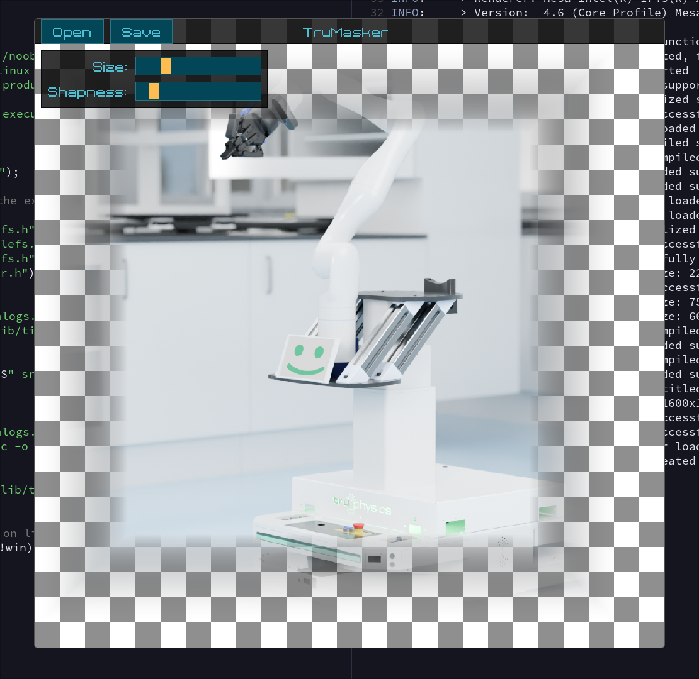

# TruMasker

Simple image editing program to quickly mask an image on the alpha channel (using either a square or circle mask). Both Windows and Linux are supported.
This program was made for a pretty specific use case I had at work - it was made for that and only that. If you still find it or its code useful - please let me know :)

The masking is done on the GPU making it extremly performant on larger resolutions while still offering a live "what you see is what you get" preview.

## Building

This is build using my own [noob build system](https://github.com/nailuj05/noob) - meaning you will only have to compile noob.c using your systems C compiler. 
Running noob will then compile the main application, see its help page for more information. 

## Usage

Opening the application will prompt you with 2 buttons in the top bar. Open a PNG to edit it, you can adjust the mask using the scale and sharpness sliders.
You can switch between masks (circle and rectangle) using `SPACE`. Saving via the Save button will then save the modified image.

